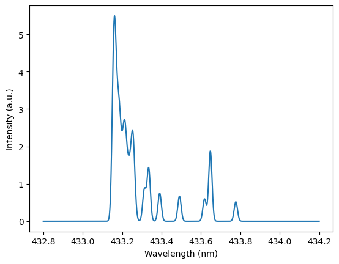

### 02_quickstart (from examples/02_quickstart.ipynb)

```python

import numpy as np
import matplotlib.pyplot as plt
from bh_molecule.dataio import load_v00_wavelengths
from bh_molecule.physics import BHModel

```

```python

model = BHModel()
x = np.linspace(432.8, 434.2, 4000)  # nm
y = model.full_fit_model(x, C=5.0, T_rot=3500, dx=0.0, w_inst=0.02, base=0.0, I_R7=0.04, I_R8=0.03)

plt.plot(x, y)
plt.xlabel("Wavelength (nm)")
plt.ylabel("Intensity (a.u.)")

```

