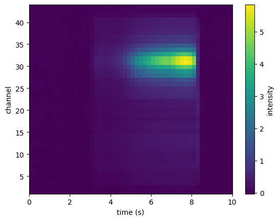
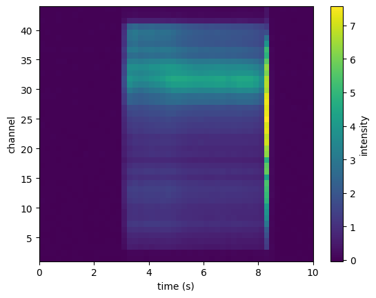

### 03_load_spectral_data (from examples/03_load_spectral_data.ipynb)

```python

from bh_molecule.instruments.vis133m import Vis133M

```

```python

FITS = './133mVis_169626.fits'
wavecal_csv = './133mVis_wavcal.csv'
s26 = Vis133M(FITS,wavecal_csv)
s26.set_scale(0.0001837)
s26.set_dark(frame=49, channel=43)
s26.set_baseline_zero(True)
s26.set_time_linspace(0, 10)

```

```python

s26.plot_pixel_range(456,642)

```



```python

s26.plot_band_map((433.9, 435))

```



```python

fig = s26.plot_spectrum_plotly(31, 30)
fig.show()

```