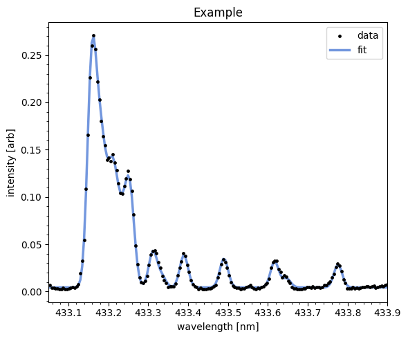
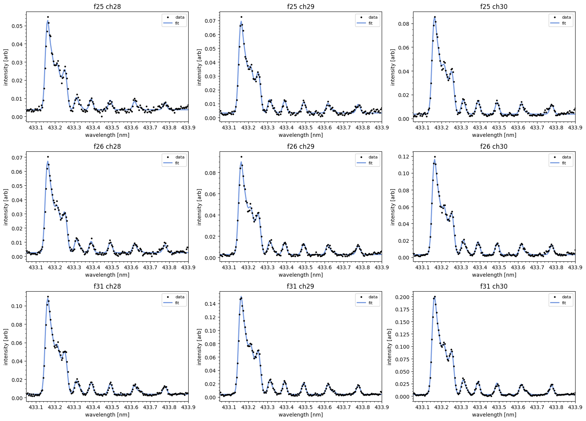
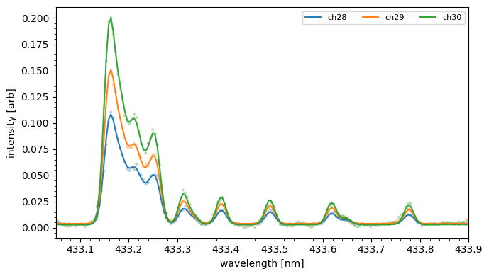

### 04_bh_fit (from examples/04_bh_fit.ipynb)

```python

import numpy as np
import pandas as pd
import matplotlib.pyplot as plt

from bh_molecule.instruments.vis133m import Vis133M
from bh_molecule.dataio import load_v00_wavelengths
from bh_molecule.physics import BHModel

```

```python

from bh_molecule.fit import BHFitter

```

```python

FITS = './133mVis_169626.fits'
wavecal_csv = './133mVis_wavcal.csv'
s26 = Vis133M(FITS,wavecal_csv)
s26.set_scale(0.0001837)
s26.set_dark(frame=49, channel=43)
s26.set_baseline_zero(True)
s26.set_time_linspace(0, 10)
#s26.plot_band_map((432.5,433.85))

```

```python

model = BHModel()

```

```python

fitr = BHFitter(s26, model, warm_start=True, weight="none")
res = fitr.fit(frame=38, channel=31)
display(res["summary"])
_ = fitr.plot_single(res, title="Example")

```



```python

list(range(24,31))

```

```python

resb,curves = fitr.batch((25,26,31), range(28,31),return_curves=True)

```

```python

_ = fitr.plot_grid(curves)

```



```python

fitr.plot_overlay(curves,frame=31,channels=range(28,31),line_width=1.5)

```

